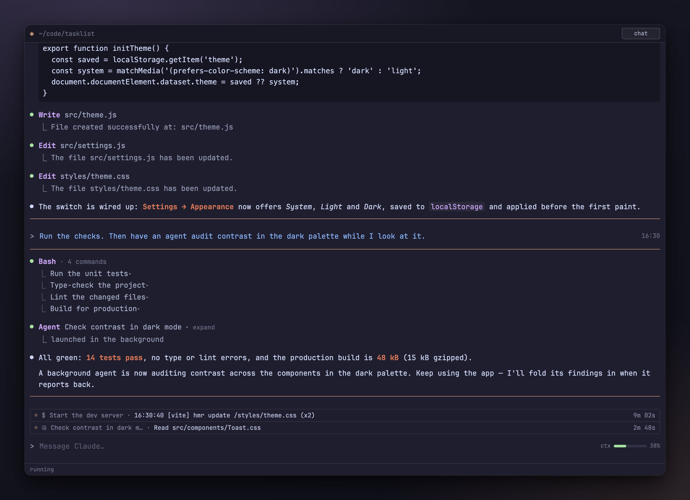
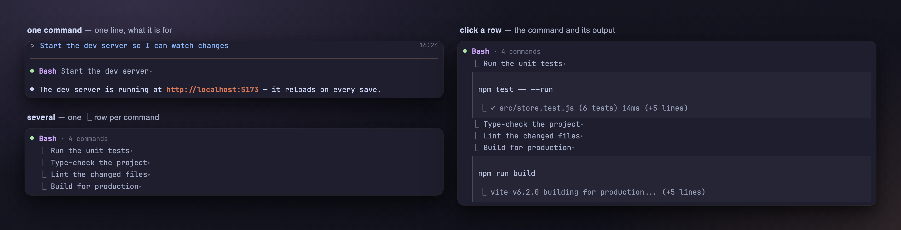
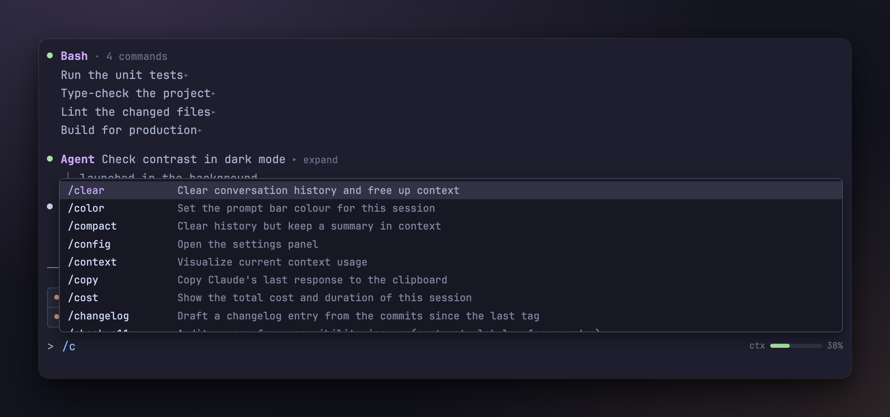
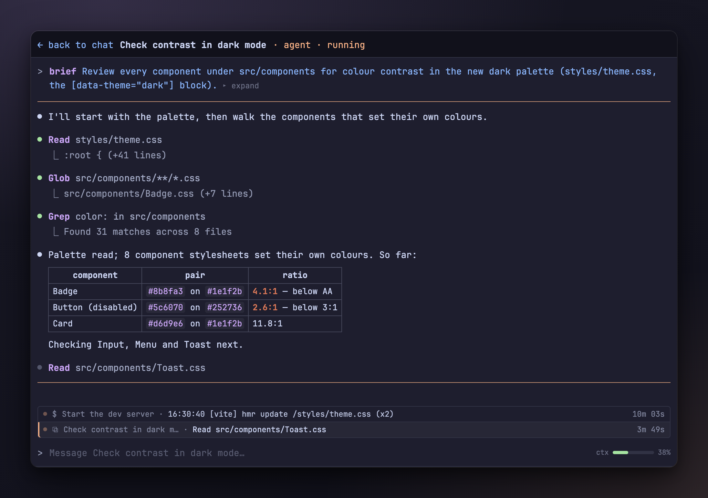
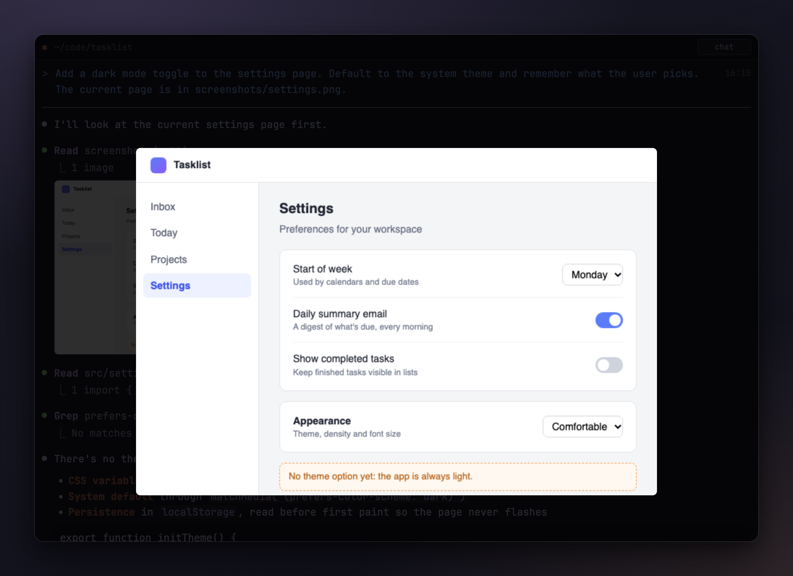
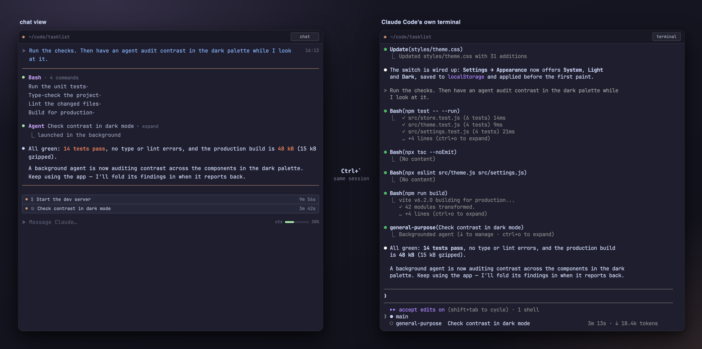
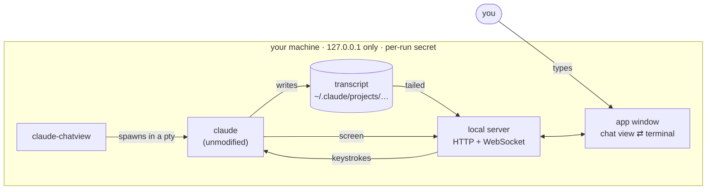

<div align="center">

# claude-chatview

**A calm, chat-style window over the real Claude Code.**<br>
Your conversation drawn as a chat — Claude Code's own terminal one key away.




</div>

## Why

Claude Code's terminal UI is great at what it does. But a long session is a lot
of scrolling text, and reading back what happened — which commands ran, what an
agent is up to, what that screenshot looked like — is work.

claude-chatview is a **reading layer on top, not a replacement**. The `claude`
you already have runs unmodified in a pseudo-terminal; the window draws the
conversation from the transcript Claude Code writes, and what you type is typed
into that terminal. So everything Claude Code does still works — slash
commands, `Esc` to interrupt, `Shift+Tab` modes, `!` shell commands, subagents,
`/resume`, your settings, hooks and MCP servers — because it *is* Claude Code.

## Features

- **A chat, not a scrollback.** Your prompts on top with the time you sent
  them; Claude's turn between two orange lines — replies as markdown, tool
  calls with purple names and a one-line `⎿` result.
- **Bash runs fold into one block.** A single Bash call is one line —
  `● Bash  what it is for ▸`. Back-to-back calls become one `Bash · N commands`
  block with a `⎿` row per command. Click a row for the command and its output.

  

- **Commands at your fingertips.** Type `/` for a dropdown of Claude Code's
  commands, your skills and your plugins. It only completes the text — Claude
  Code still runs the command.

  

- **Background work you can see — and talk to.** Background agents and shells
  sit in a stacked list above the prompt with their running time and what each
  is doing right now — an agent's latest tool call or reply line, a shell's
  last output line (`Check contrast… · Read src/components/Toast.css`). Open an agent
  to read its transcript as it works; the input then messages *that* agent,
  through Claude Code's own subagent panel. A shell opens its live output.

  

- **Images inline.** Screenshots in prompts and tool results are drawn as
  thumbnails; click one for full size. Pasting a screenshot into the input
  puts Claude Code's own `[Image #N]` token there — delete the token and the
  image goes with it.

  

- **The real terminal is one key away.** `` Ctrl+` `` flips between the chat
  view and Claude Code's own screen — same session, nothing restarted. Any
  dialog the chat view does not draw (a permission prompt, `/config`, `/model`,
  a picker, the trust dialog) switches to the real terminal automatically, and
  back once the prompt returns.

  

- Agent briefs and messages from agents fold to one line; click to expand.
- `AskUserQuestion` shows its question; click for the options, and the answer
  reads `answered: <choice>`.
- A small context-window bar (optional, see [below](#the-context-bar)).
- Catppuccin Mocha, with JetBrains Mono Nerd Font bundled.

## Install

You need **Node 18+** and **npm**, **[Claude Code](https://docs.claude.com/en/docs/claude-code)**
itself, and preferably a Chromium-family browser (Chromium, Chrome, Brave,
Edge or Vivaldi) for the app window.

### Linux

node-pty, the one npm dependency, is compiled during install, so get a build
toolchain first:

```sh
sudo apt-get install -y python3 make g++        # Debian / Ubuntu
sudo dnf install -y python3 make gcc-c++        # Fedora
sudo pacman -S --needed python make gcc         # Arch
```

Then:

```sh
git clone https://github.com/emrehannn/claude-chatview ~/claude-chatview
cd ~/claude-chatview
./install.sh
```

### macOS

```sh
xcode-select --install          # only if you have no command line tools yet
git clone https://github.com/emrehannn/claude-chatview ~/claude-chatview
cd ~/claude-chatview
./install.sh
```

### What `install.sh` does

It checks node, runs `npm ci`, and links `claude-chatview` and
`claude-chatview-statusline` into `~/.local/bin`. Then it **asks** (default
no) before each optional change:

1. set the statusLine relay in `~/.claude/settings.json` (for the context bar);
2. add to `~/.bashrc` / `~/.zshrc`:

   ```sh
   claude() { claude-chatview "$@"; }
   alias claude-plain='command claude'
   ```

`./install.sh --yes` answers yes to both.

## Usage

```sh
cd ~/some/project
claude                    # with the shell function; or `claude-chatview`
claude --model opus       # any claude argument passes straight through
claude -c                 # continue the last conversation
claude --resume           # the picker shows in the window's terminal
claude-plain              # plain Claude Code, always
```

One window is one Claude session, in the directory you started it from. It
opens as an app window (no tabs, no address bar); set `CLAUDE_CHATVIEW_BROWSER`
to pick the browser (`%u` is replaced by the URL).

| Key | |
|---|---|
| `` Ctrl+` `` | chat view ⇄ Claude Code's terminal (also the button top right; remembered) |
| `Enter` / `Shift+Enter` | send / new line |
| `Esc` | interrupt |
| `Ctrl+C` | Claude Code's Ctrl+C |
| `Ctrl` + `=` `-` `0` (`Cmd` on macOS) | font size |

- Long prompts are sent as a paste, so nothing is lost.
- Reloading the window is fine — the session keeps running and the screen is
  restored. Closing it stops Claude Code about 10 seconds later.
- When Claude Code exits, the window says so and `claude-chatview` exits with
  Claude Code's exit code.

**What runs plain.** Anything that is not an interactive session runs plain
`claude` in your terminal, so pointing `claude` at this is safe: `-p` /
`--print`, `--help`, `--version`, subcommands (`claude mcp …`,
`claude update`, …), piped stdin, and on Linux a session with no
`DISPLAY` / `WAYLAND_DISPLAY` (ssh). Force it either way with
`CLAUDE_CHATVIEW=off` or `CLAUDE_CHATVIEW=force`.

## How it works



- **The real TUI stays the engine.** The chat view draws Claude Code's own
  transcript, and the input line types into the pty. The screen is read for
  one thing only — *is the ordinary prompt up?* — and when it is not, the
  window shows the terminal.
- **Local only.** The server listens on `127.0.0.1`, on a random port. The
  window is opened with a one-time link that is traded for an HttpOnly,
  SameSite=Strict cookie holding a per-run secret; every request and the
  WebSocket need it (the socket also checks the Origin). Other users on the
  machine and other web pages cannot drive the terminal.

## The context bar

Claude Code tells its statusLine command how full the context window is, and
nobody else. `claude-chatview-statusline` is a statusLine command that passes
those two numbers to the running window and then runs **your previous
statusLine command unchanged** — `install.sh` saves it in
`~/.config/claude-chatview/previous-statusline.json` — so your status line in a
plain terminal looks exactly as before. Without the relay the bar simply does
not show.

## Limits and FAQ

- **It follows Claude Code's transcript format** and recognises its prompt on
  screen. A Claude Code update that changes either can make the chat view miss
  things — the terminal is always one key away.
- **Turns appear tool by tool**, as Claude Code writes them, not token by token
  (Claude Code logs a reply whole; its paragraphs ease in one after another).
- **Linux is the target, but not fully verified yet**: node-pty compiling on
  your distro and the window opening are the untested parts.
- **Wayland**: a session starts when `WAYLAND_DISPLAY` is set and opens the
  window through your browser; this has not been tried on a Wayland desktop yet.
- **No Chromium-family browser?** The page opens as a tab in your default
  browser instead — it works, just with browser chrome around it.
- `--resume <search>`, `--continue` and `--fork-session` are followed by
  watching which conversation Claude Code reports; it can take a second after
  start to pick the right one.
- Images are drawn up to about 4.5 MB each.
- **Windows is not supported.**

## Uninstall

```sh
cd ~/claude-chatview
./uninstall.sh            # shows the plan, asks once (--yes to skip)
```

It removes the `~/.local/bin` links, the rc-file block and the statusLine relay
(putting your previous status line back), and keeps backups
(`*.claude-chatview.bak`). The checkout itself is left for you to delete.

---

<sub>Bundled third-party code: xterm.js and its fit / WebGL addons (MIT), and
JetBrains Mono Nerd Font Mono (SIL OFL 1.1); their licenses are next to them
under `public/vendor/`. `npm run check` syntax-checks every file.</sub>
